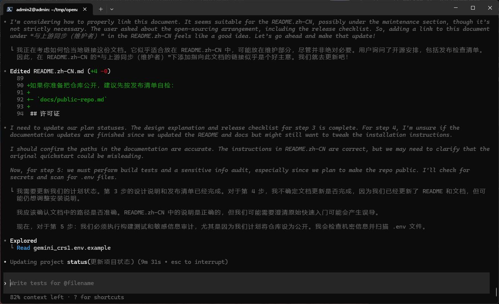

> **Important (Fork Notice)**: This repository is a fork of `openai/codex` and is **not an official OpenAI repository**.
>
> - The `npm` / `brew` commands below install the **official** OpenAI distribution (without this fork's translation plugin).
> - To use the **Agent Reasoning Translation Plugin** in this fork, build and run the `codex` binary from this repository (see `docs/translation.md`).
>
> **Privacy Notice**: Reasoning content may include code snippets, file paths, and commands. If your translator sends data to an online service, make sure it matches your privacy/compliance requirements (or use a local/offline translator).

<p align="center"><code>npm i -g @openai/codex</code><br />or <code>brew install --cask codex</code></p>
<p align="center"><strong>Codex CLI</strong> is a coding agent from OpenAI that runs locally on your computer.
<p align="center">
  
</p>
</br>
If you want Codex in your code editor (VS Code, Cursor, Windsurf), <a href="https://developers.openai.com/codex/ide">install in your IDE.</a>
</br>If you are looking for the <em>cloud-based agent</em> from OpenAI, <strong>Codex Web</strong>, go to <a href="https://chatgpt.com/codex">chatgpt.com/codex</a>.</p>

---

## Fork: Agent Reasoning Translation Plugin (optional)

This repository is a fork of `openai/codex` that adds an **external command** translation hook for `AgentReasoning` (e.g. `Thinking` / `Analyzing`) so the TUI/TUI2 can display bilingual reasoning blocks.



- Chinese README: `README.md`
- 插件设计/协议/示例：`docs/translation.md`
- Troubleshooting (WSL / terminal CPR issues): `docs/troubleshooting.md`
- Tested primarily on **Windows 11 via WSL2**; other environments have not been systematically verified yet.
- Issues: please file issues in this fork first; if it looks like an upstream issue (`openai/codex`), include a link to the upstream issue (or the search keywords + repro steps) so we can track and sync the fix.

This is not an official OpenAI repository.

Note: the npm / Homebrew installation instructions below install the official OpenAI distribution. To use this fork-specific feature, build and run the `codex` binary from this repository.

### Build and run this fork (recommended for the plugin)

Build `codex` from source:

```shell
git clone https://github.com/EnvyGithub/codex.git
cd codex/codex-rs
cargo build -p codex-cli --release
./target/release/codex --version
```

Then run:

```shell
./target/release/codex
```

To enable the translation hook, configure `plugins.translation.agent_reasoning.command` (i.e. the `[plugins.translation.agent_reasoning]` table) in `~/.codex/config.toml` (see `docs/translation.md`). Legacy `translation.agent_reasoning` is still supported but deprecated; do not define both in the same scope (root or the same profile) — it will error with a migration hint.

### Maintainers: keep in sync with upstream releases

This fork provides a helper script for rebasing the patch stack onto the latest stable upstream release tag (and optionally building/linking/verifying):

```shell
./scripts/dev-sync-upstream.sh --non-interactive --build both --link both --verify quick
```

For maintainer notes before making this repository public, see `docs/public-repo.md`.

## Quickstart

### Installing and running Codex CLI

Install globally with your preferred package manager:

```shell
# Install using npm
npm install -g @openai/codex
```

```shell
# Install using Homebrew
brew install --cask codex
```

Then simply run `codex` to get started.

<details>
<summary>You can also go to the <a href="https://github.com/openai/codex/releases/latest">latest GitHub Release</a> and download the appropriate binary for your platform.</summary>

Each GitHub Release contains many executables, but in practice, you likely want one of these:

- macOS
  - Apple Silicon/arm64: `codex-aarch64-apple-darwin.tar.gz`
  - x86_64 (older Mac hardware): `codex-x86_64-apple-darwin.tar.gz`
- Linux
  - x86_64: `codex-x86_64-unknown-linux-musl.tar.gz`
  - arm64: `codex-aarch64-unknown-linux-musl.tar.gz`

Each archive contains a single entry with the platform baked into the name (e.g., `codex-x86_64-unknown-linux-musl`), so you likely want to rename it to `codex` after extracting it.

</details>

### Using Codex with your ChatGPT plan

Run `codex` and select **Sign in with ChatGPT**. We recommend signing into your ChatGPT account to use Codex as part of your Plus, Pro, Team, Edu, or Enterprise plan. [Learn more about what's included in your ChatGPT plan](https://help.openai.com/en/articles/11369540-codex-in-chatgpt).

You can also use Codex with an API key, but this requires [additional setup](https://developers.openai.com/codex/auth#sign-in-with-an-api-key).

## Docs

- [**Codex Documentation**](https://developers.openai.com/codex)
- [**Contributing**](./docs/contributing.md)
- [**Installing & building**](./docs/install.md)
- [**Open source fund**](./docs/open-source-fund.md)
- [**Agent reasoning translation (fork)**](./docs/translation.md)

This repository is licensed under the [Apache-2.0 License](LICENSE).
